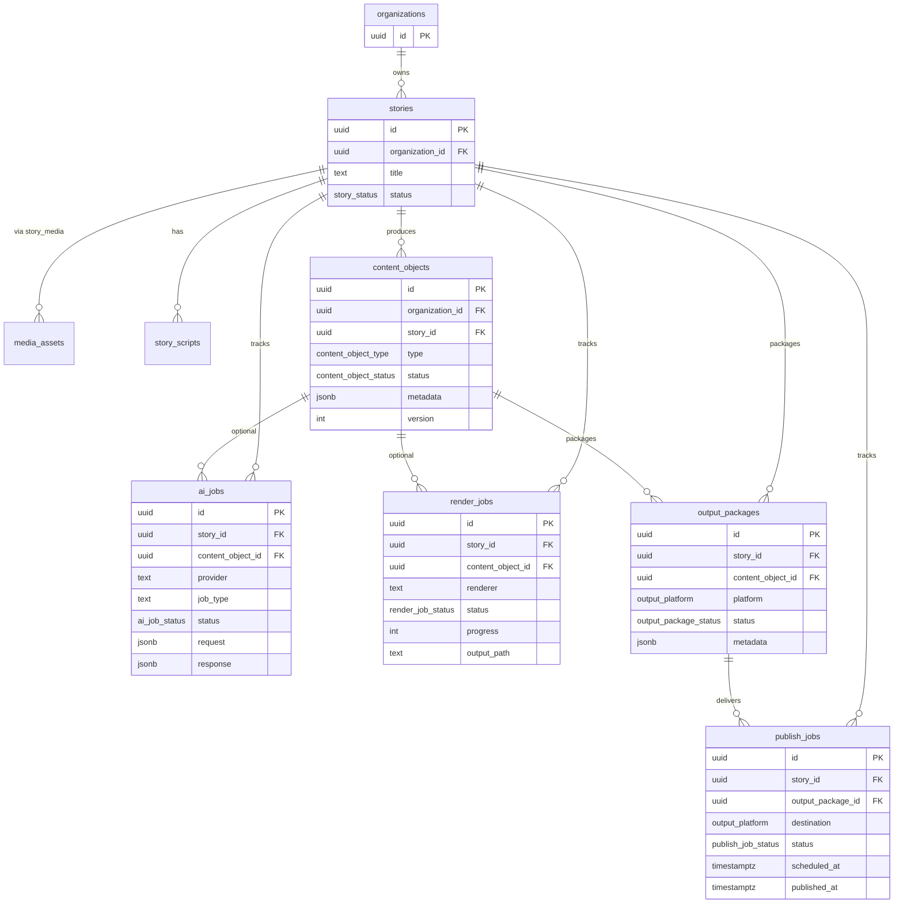

# MediaOS Core Content Architecture

Feature **004.5** defines the story-centric data model that every future MediaOS module plugs into.

> Scope of this sprint: schema, RLS, TypeScript types, and service foundations only.  
> Not included: AI execution, rendering, publishing adapters, or timeline editing.

---

## Entity relationship diagram



---

## Relationship explanation

| From | To | Cardinality | Notes |
| --- | --- | --- | --- |
| **Story** | Media assets | 1 : N | Via existing `story_media` (Feature 003) |
| **Story** | Content objects | 1 : N | Canonical work products (script package, graphic, clip, …) |
| **Story** | AI jobs | 1 : N | Ledger rows; may optionally reference a content object |
| **Story** | Render jobs | 1 : N | Encode / compose jobs for timeline & BroadcastOS |
| **Story** | Output packages | 1 : N | Platform-shaped delivery units |
| **Story** | Publish jobs | 1 : N | Destination delivery attempts |
| **Content object** | Output packages | 1 : N | One object can ship to many platforms |
| **Content object** | AI / render jobs | 1 : N | Optional FK (`ON DELETE SET NULL`) |
| **Output package** | Publish jobs | 1 : N | Retries / schedules per package |

**Organization denormalization:** every new table carries `organization_id` so RLS can use `is_org_member(organization_id)` without joining through `stories` on every policy check.

**Soft delete:** `content_objects` and `output_packages` use `deleted_at`. Job tables are append-oriented ledgers (status transitions, no hard delete via RLS).

**Cascades:**

- Deleting a **story** cascades to content objects, packages, and jobs.
- Deleting a **content object** cascades to its output packages; AI/render FKs null out.
- Deleting an **output package** cascades to publish jobs.

---

## Table summary

| Table | Role |
| --- | --- |
| `content_objects` | Versioned story work products |
| `output_packages` | Platform packaging (`youtube`, `reels`, `broadcast`, …) |
| `ai_jobs` | AI request/response ledger (`provider`, `model`, tokens, cost) |
| `render_jobs` | Render progress ledger (`renderer`, `progress`, `output_path`) |
| `publish_jobs` | Publish attempts (`destination`, schedule, response/error) |

Migration: `supabase/migrations/20260324000007_core_content_architecture.sql`

---

## Application layer

```
src/features/content/
  constants/content-enums.ts
  types/content.types.ts
  services/
    content.service.ts      → ContentService
    ai-job.service.ts       → AIJobService
    render.service.ts       → RenderService
    publishing.service.ts   → PublishingService
  index.ts
```

Services expose list/get/create/update (and soft-delete for content objects). They do **not** call AI providers, renderers, or social APIs.

---

## Future expansion notes

1. **Link `story_scripts` → `content_objects`**  
   Promote the TipTap script document into a `type = script` content object (or dual-write) so History/versioning is unified.

2. **AI orchestration**  
   Workers dequeue `ai_jobs` (`queued` → `running` → `succeeded|failed`), write `response`, `tokens_used`, `cost`, `processing_time_ms`.

3. **Timeline / BroadcastOS**  
   Timeline edits produce `content_objects` (`timeline` / `video_package`) and enqueue `render_jobs`.

4. **Publishing adapters**  
   Per-platform connectors consume `publish_jobs`, update `published_at` / `response` / `error`, and flip `output_packages.status`.

5. **Permissions**  
   Fine-grained codes (`content.create`, `ai.run`, `publish.execute`) can wrap the existing member RLS.

6. **Realtime**  
   Subscribe to job status changes for Story Workspace side panels (Tasks / Recent Activity).

7. **Cost & audit**  
   Aggregate `ai_jobs.cost` and publish responses into org-level analytics.
